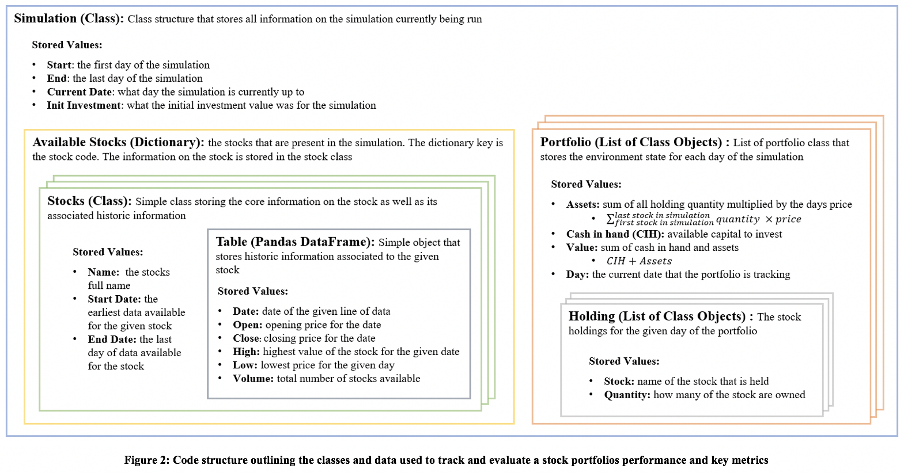
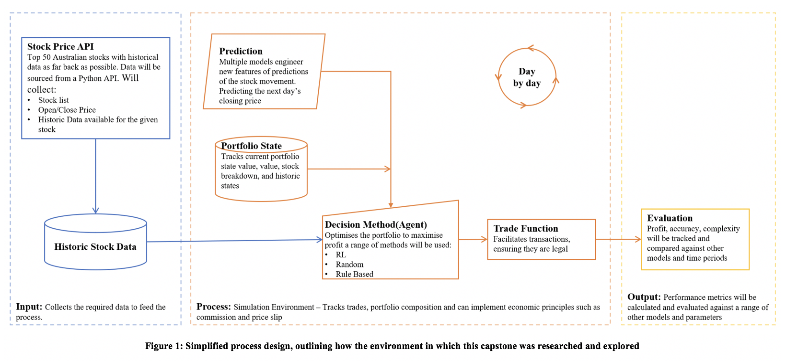

# Pluto: Take your Finances out of this Solar System #
This code is used for an postgraduate thesis, it focuses on understanding the potential of 
Reinforcement Learning to optimise a stock portfolio given current and project prices

##### Metadata #####
**Author:** Cameron Wasilewsky

**University:** University of Sydney

**Profession:** Consultant

**Build Dates:** 10 Nov 2017 to Ongoing
## Instructions ##
To run the code an individual will need to pull this entire repo, re run the refresh of data and predictions
## Purpose ##
The objective of this project is to assess the power of Reinforcement Learning in optimisating a stock market portfolio
## Code Structure ##
* **Base Folder:**
    * Pluto.py - _Main function run the system enabling all other functions_
    * **Setup:**
        * Constants.py - _All system constants are defined here, such as which stock to use and print statements_
        * Init_Stock.py - _Loads all stocks to use in the simulation_
        * Init_Sytem.py - _Collects systems paths and creates the initial requirements for the system_
    * **Prediction:**
        * Prediction.py - _Implements Technical and Machine learning predictions as well as creating futher features for feature engineering_
    * **Output:**
        * OutputFile.py - _Method used to connect to google drive, build a sheet and store metrics_
    * **Decision:**
        * Decision.py - _Methods to decide which stock to invest in, has Random, Rule based and then RL
    * **Classes:**
        * Stock.py - _Stores the history and all values associated to a stock, it is the loaded data for the stock_
        * Holding.py - _Call that stores all details on a purchased stock such as price and quantity_
        * Portfolio.py - _Collection of stocks that have been purchased, is is a snapshot of the current state_
        * Simulation.py - _Collection of portfolio snapshots for each day of the simulation, it also allows for transactiosn to take place_
    * **Benchmarking:**
        * Evaluate.py - _Methods used to evaluate the final performance of the system as well as prediction performance_
    
## Machine Learning ##
### Prediction Methods ###
#### Random Forrest ####
A simple random forest time series regression has been implemented. Its initial performance indicates a MAE of 
#### Linear Regression ####
Linear regression is the simplest implmentation and is using ANOVA. Initial implementations indicate a MAE of
#### Neural Networks ####
The Neural Nework implementation has not been optimised and does not perform well it is used as another feature and will be asssesed for its value.
It has an MAE of 
### Action Methods ###
#### Random Choice ####
Random choice is as described it will output a random action (Buy/Sell/Hold/Move to Next Day), a random stock selection and then the action will be completed for the full available stocks possible
#### Largest Projected Growth ####
Utilising the Random Forest prediction a rull based method is implemented. If it is predicted to decrease tomorrow sell all of that stock,
if predicted to increase buy that stock, of those predicted to increase the proportianlly breakdown the availabel cash in hand by the forecast increase of each stock
#### Reinforcement Learning ####
To Be Implemented

## Code Details ##

### Required Library ###
For this code to work we need to a user will need to ensure the following libraries are installed.

| Library        | Use          |
| :-------------: |-------------|
| numpy | Matrix calculations |
| pandas | df storage|
| Tensor Flow | Machine learning|
| time | measure time for processes to run|
| os | path manipulation|
| sklearn | Machine Learning Modelling and validation|
| csv | output files of data|
| pickle | saving models|
| pathlib | selecting paths and manipulating them|
| seaborn | graphing heat map|

## To Be ##
### Potential Improvements ###

### Key Considerations and Risks ###
Going forward the following should be resolved or at least considered prior to starting the engagement. this will ensure no issues will arise later

|Risk	|Description	|Mitigation Option (s)|
|:-------------: |-----------------|-------------|
